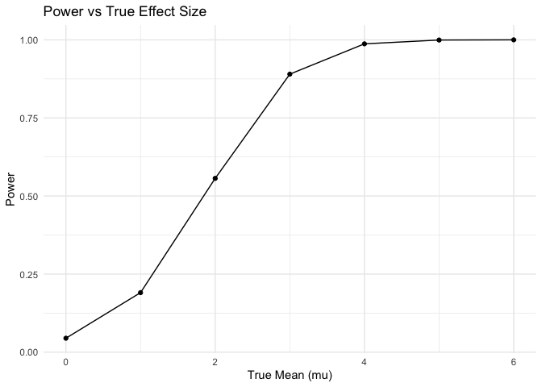
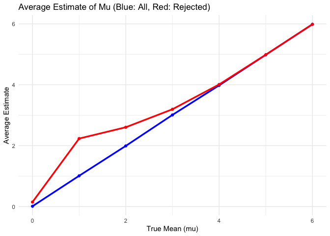
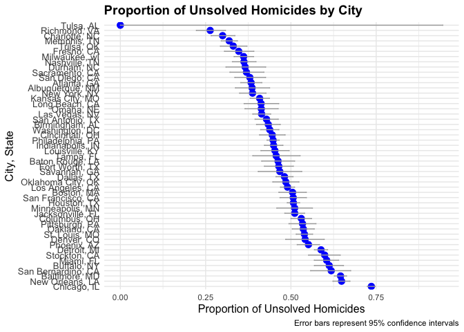

p8105_hw5_xk2163
================
Kang
2024-11-16

``` r
library(tidyverse)
library(ggplot2)
```

# Question 2

``` r
set.seed(123)
n = 30         
sigma = 5       
mu_values = c(0, 1, 2, 3, 4, 5, 6) # True mean values
alpha = 0.05    
n_simulations = 5000
```

In the first part, we need to define all the parameters we are goiing to
use in the the question 2.

``` r
simulate_t_test = function(mu, n, sigma, n_simulations) {
  results = replicate(n_simulations, {
    x = rnorm(n, mean = mu, sd = sigma)
    t_test = t.test(x, mu = 0)
    tidy_t = broom::tidy(t_test)
    c(mu_hat = tidy_t$estimate, p_value = tidy_t$p.value)
  }, simplify = TRUE)
  
  results_df = as.data.frame(t(results))
  names(results_df) = c("mu_hat", "p_value")
  results_df$true_mu = mu
  return(results_df)
}

all_results = lapply(mu_values, simulate_t_test, n = n, sigma = sigma, n_simulations = n_simulations)
all_results = bind_rows(all_results)
```

For convenience, I generate this procedure into a function which can
make this procedure much more clear and efficient.

``` r
power_results = all_results |>
  group_by(true_mu) |>
  summarize(power = mean(p_value < alpha))

ggplot(power_results, aes(x = true_mu, y = power)) +
  geom_line() +
  geom_point() +
  labs(title = "Power vs True Effect Size",
       x = "True Mean (mu)",
       y = "Power") +
  theme_minimal()
```

<!-- -->

The x-axis as the true mean ($\mu$), representing the effect size.The
y-axis as the power, representing the proportion of times the null
hypothesis is rejected.A curve showing that power increases with larger
effect sizes.

``` r
average_results = all_results |>
  group_by(true_mu) |>
  summarize(
    avg_mu_hat = mean(mu_hat),
    avg_mu_hat_rejected = mean(mu_hat[p_value < alpha]))

ggplot(average_results, aes(x = true_mu)) +
  geom_line(aes(y = avg_mu_hat), color = "blue", size = 1.2) +
  geom_line(aes(y = avg_mu_hat_rejected), color = "red", size = 1.2) +
  geom_point(aes(y = avg_mu_hat), color = "blue") +
  geom_point(aes(y = avg_mu_hat_rejected), color = "red") +
  labs(title = "Average Estimate of Mu (Blue: All, Red: Rejected)",
       x = "True Mean (mu)",
       y = "Average Estimate") +
  theme_minimal()
```

    ## Warning: Using `size` aesthetic for lines was deprecated in ggplot2 3.4.0.
    ## ℹ Please use `linewidth` instead.
    ## This warning is displayed once every 8 hours.
    ## Call `lifecycle::last_lifecycle_warnings()` to see where this warning was
    ## generated.

<!-- -->

The graph illustrates two sets of data:

- The blue line represents the average estimate of $\hat \mu$ across all
  tests, irrespective of whether the null hypothesis was rejected.

- The red line represents the average estimate of $\hat \mu$ only for
  tests where the null hypothesis ($H_0:\mu = 0$) was rejected.

The sample average of $\hat \mu$ across tests for which the null was
rejected is not approximately equal to the true value of $\mu$. This
occurs because rejecting the null hypothesis selects tests with larger
sample means, introducing a bias (seen in the red line) that
overestimates the true mean. In contrast, the blue line (all tests)
shows an unbiased estimate of $\mu$.

# Question 3

``` r
data_df = 
  read_csv("Data/homicide-data.csv") |> 
  janitor::clean_names() |> 
  mutate(city_state = paste(city,state, sep = ", "),
         victim_age = as.numeric(victim_age)) |> 
    select(-uid)
```

    ## Rows: 52179 Columns: 12
    ## ── Column specification ────────────────────────────────────────────────────────
    ## Delimiter: ","
    ## chr (9): uid, victim_last, victim_first, victim_race, victim_age, victim_sex...
    ## dbl (3): reported_date, lat, lon
    ## 
    ## ℹ Use `spec()` to retrieve the full column specification for this data.
    ## ℹ Specify the column types or set `show_col_types = FALSE` to quiet this message.

    ## Warning: There was 1 warning in `mutate()`.
    ## ℹ In argument: `victim_age = as.numeric(victim_age)`.
    ## Caused by warning:
    ## ! NAs introduced by coercion

``` r
head(data_df)
```

    ## # A tibble: 6 × 12
    ##   reported_date victim_last victim_first victim_race victim_age victim_sex city 
    ##           <dbl> <chr>       <chr>        <chr>            <dbl> <chr>      <chr>
    ## 1      20100504 GARCIA      JUAN         Hispanic            78 Male       Albu…
    ## 2      20100216 MONTOYA     CAMERON      Hispanic            17 Male       Albu…
    ## 3      20100601 SATTERFIELD VIVIANA      White               15 Female     Albu…
    ## 4      20100101 MENDIOLA    CARLOS       Hispanic            32 Male       Albu…
    ## 5      20100102 MULA        VIVIAN       White               72 Female     Albu…
    ## 6      20100126 BOOK        GERALDINE    White               91 Female     Albu…
    ## # ℹ 5 more variables: state <chr>, lat <dbl>, lon <dbl>, disposition <chr>,
    ## #   city_state <chr>

There are 52179 samples with 12 variables in the given data. For
convenice, I showed the head of the given dataset above.

After loading the required data set, I generate a new variable called
`city_state` by combining city and state as required and converted the
`victim_age` into numeric variable.

``` r
city_summary =
  data_df |> 
  group_by(city_state) |> 
  summarize(
    total_homicides = n(),
    unsolved_homicides = sum(disposition %in% c("Closed without arrest", "Open/No arrest")),
    .groups = "drop")

city_summary |> 
  knitr::kable(
    caption = "Summary of Homicides and Unsolved Cases by City",
    col.names = c("City, State", "Total Homicides", "Unsolved Homicides"),
    format = "latex")
```

Then, I use group_by to stratify the data and try to obtain the total
number of homicides and the number of unsolved homicides. I output this
table by using `knitr::kable`, and the result are shown above.

## Analysis for Baltimore, MD

``` r
baltimore_data =
  data_df |> 
  filter(city_state == "Baltimore, MD")

baltimore_total = nrow(baltimore_data)
baltimore_unsolved = sum(baltimore_data$disposition %in% c("Closed without arrest", "Open/No arrest"))

baltimore_test =
  prop.test(
  x = baltimore_unsolved,
  n = baltimore_total,
  conf.level = 0.95)

baltimore_summary = broom::tidy(baltimore_test)

baltimore_summary |> 
  select(estimate, conf.low, conf.high) |> 
  knitr::kable(
    caption = "Proportion of Unsolved Homicides in Baltimore, MD")
```

|  estimate |  conf.low | conf.high |
|----------:|----------:|----------:|
| 0.6455607 | 0.6275625 | 0.6631599 |

Proportion of Unsolved Homicides in Baltimore, MD

A one-sample proportion test (prop.test) is conducted to estimate the
proportion of unsolved homicides and compute the confidence interval.The
results are tidied using broom::tidy, and a table summarizing the
proportion and confidence interval is generated with knitr::kable.

In the above result, we can clearly see that the p-value of the
proportions test is way smaller than 0.05, which means we need to reject
the null and conclude that the successful probability is statistically
different from 0.5. And its estimate and confidence interval is shown
above as well.

## City-Wide Summary of Proportions

``` r
city_summary = 
  data_df |>
  group_by(city_state) |>
  summarize(
    total_homicides = n(),
    unsolved_homicides = sum(disposition %in% c("Closed without arrest", "Open/No arrest")),
    .groups = "drop"
  )

city_results =
  city_summary |>
  mutate(
    prop_test = map2(unsolved_homicides, total_homicides, ~ prop.test(.x, .y)),
    estimate = map_dbl(prop_test, ~ .x$estimate),
    conf.low = map_dbl(prop_test, ~ .x$conf.int[1]),
    conf.high = map_dbl(prop_test, ~ .x$conf.int[2]),
    p.value = map_dbl(prop_test, ~ .x$p.value)) |>
  select(city_state, estimate, conf.low, conf.high, p.value) |>
  mutate(
    significance = if_else(p.value < 0.05, "*", " "))
```

    ## Warning: There was 1 warning in `mutate()`.
    ## ℹ In argument: `prop_test = map2(unsolved_homicides, total_homicides,
    ##   ~prop.test(.x, .y))`.
    ## Caused by warning in `prop.test()`:
    ## ! Chi-squared approximation may be incorrect

``` r
city_results |>
  knitr::kable(
    caption = "Proportion of Unsolved Homicides by City",
    col.names = c(
      "City, State", 
      "Proportion (Estimate)", 
      "Lower CI", 
      "Upper CI", 
      "P-Value", 
      "Significance"),format = "latex")
```

The city-wise summary calculates the proportion of unsolved homicides
and uses prop.test for each city to obtain estimates, confidence
intervals, and p-values. The map2 function applies prop.test row-by-row,
and map_dbl extracts numeric values from the results.A significance
column is added to indicate whether the result is statistically
significant (p\<0.05).The results are output as a formatted table with
clear column names and captions.

## Visualization for City-wide Summary

``` r
city_results = city_results |>
  arrange(desc(estimate)) |>
  mutate(city_state = factor(city_state, levels = city_state))

ggplot(city_results, aes(x = city_state, y = estimate)) +
  geom_point(size = 3, color = "blue") +
  geom_errorbar(aes(ymin = conf.low, ymax = conf.high), width = 0.2, color = "darkgray") +
  coord_flip() + 
  labs(
    title = "Proportion of Unsolved Homicides by City",
    x = "City, State",
    y = "Proportion of Unsolved Homicides",
    caption = "Error bars represent 95% confidence intervals") +
  theme_minimal() +
  theme(
    axis.text.y = element_text(size = 10),
    axis.title = element_text(size = 12),
    plot.title = element_text(size = 14, face = "bold"))
```

<!-- -->

The cities are arranged in descending order of the proportion of
unsolved homicides to make the plot more interpretable.A scatter plot is
created to visualize the proportions, and error bars represent the 95%
confidence intervals. And the plot are shown above.
