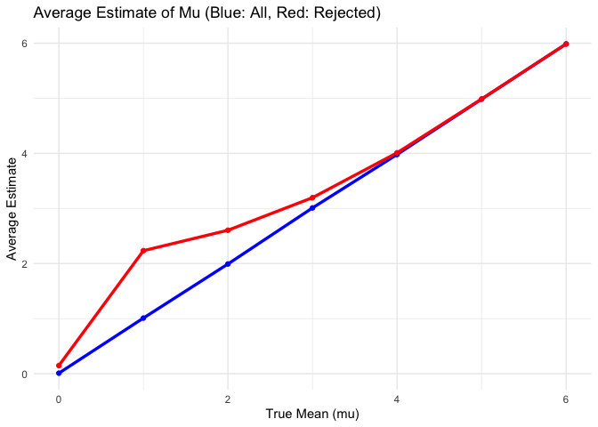

p8105_hw5_xk2163
================
Kang
2024-11-16

``` r
library(tidyverse)
```

    ## ── Attaching core tidyverse packages ──────────────────────── tidyverse 2.0.0 ──
    ## ✔ dplyr     1.1.4     ✔ readr     2.1.5
    ## ✔ forcats   1.0.0     ✔ stringr   1.5.1
    ## ✔ ggplot2   3.5.1     ✔ tibble    3.2.1
    ## ✔ lubridate 1.9.3     ✔ tidyr     1.3.1
    ## ✔ purrr     1.0.2     
    ## ── Conflicts ────────────────────────────────────────── tidyverse_conflicts() ──
    ## ✖ dplyr::filter() masks stats::filter()
    ## ✖ dplyr::lag()    masks stats::lag()
    ## ℹ Use the conflicted package (<http://conflicted.r-lib.org/>) to force all conflicts to become errors

# Question 2

``` r
set.seed(123)
n = 30         
sigma = 5       
mu_values = c(0, 1, 2, 3, 4, 5, 6) # True mean values
alpha = 0.05    
n_simulations = 5000
```

``` r
simulate_t_test = function(mu, n, sigma, n_simulations) {
  results = replicate(n_simulations, {
    x = rnorm(n, mean = mu, sd = sigma)
    t_test = t.test(x, mu = 0)
    tidy_t = broom::tidy(t_test)
    c(mu_hat = tidy_t$estimate, p_value = tidy_t$p.value)
  }, simplify = TRUE)
  
  results_df = as.data.frame(t(results))
  names(results_df) = c("mu_hat", "p_value")
  results_df$true_mu = mu
  return(results_df)
}

all_results = lapply(mu_values, simulate_t_test, n = n, sigma = sigma, n_simulations = n_simulations)
all_results = bind_rows(all_results)
```

``` r
power_results = all_results |>
  group_by(true_mu) |>
  summarize(power = mean(p_value < alpha))

# Plot the power curve
ggplot(power_results, aes(x = true_mu, y = power)) +
  geom_line() +
  geom_point() +
  labs(title = "Power vs True Effect Size",
       x = "True Mean (mu)",
       y = "Power") +
  theme_minimal()
```

<!-- -->

``` r
# Calculate average estimates
average_results = all_results |>
  group_by(true_mu) |>
  summarize(
    avg_mu_hat = mean(mu_hat),
    avg_mu_hat_rejected = mean(mu_hat[p_value < alpha])
  )

# Plot the averages
ggplot(average_results, aes(x = true_mu)) +
  geom_line(aes(y = avg_mu_hat), color = "blue", size = 1.2) +
  geom_line(aes(y = avg_mu_hat_rejected), color = "red", size = 1.2) +
  geom_point(aes(y = avg_mu_hat), color = "blue") +
  geom_point(aes(y = avg_mu_hat_rejected), color = "red") +
  labs(title = "Average Estimate of Mu (Blue: All, Red: Rejected)",
       x = "True Mean (mu)",
       y = "Average Estimate") +
  theme_minimal()
```

    ## Warning: Using `size` aesthetic for lines was deprecated in ggplot2 3.4.0.
    ## ℹ Please use `linewidth` instead.
    ## This warning is displayed once every 8 hours.
    ## Call `lifecycle::last_lifecycle_warnings()` to see where this warning was
    ## generated.

<!-- -->
